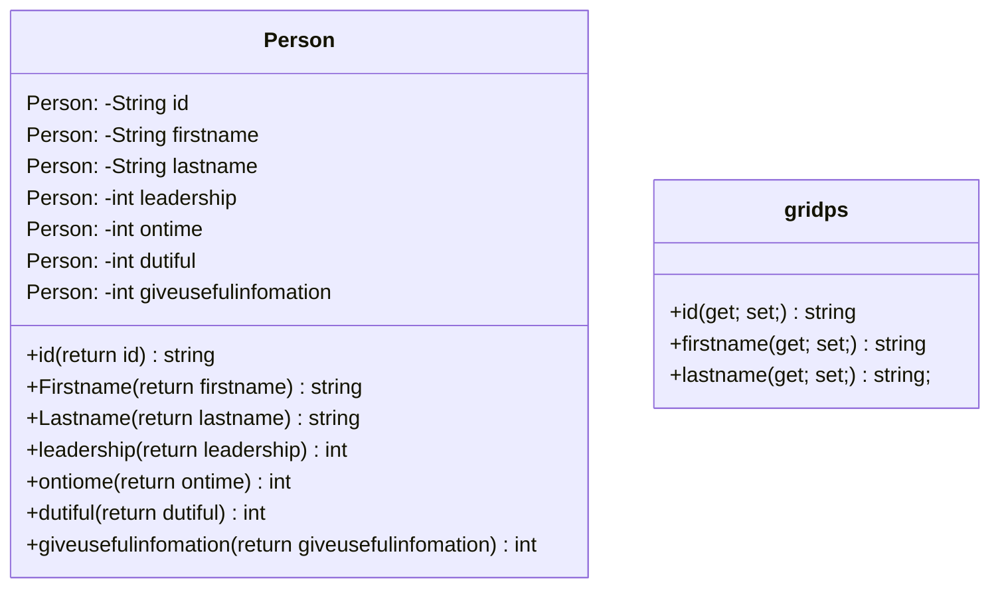

ความเป็นมาของโปรแกรม โปรเตคนี้ได้รับความคิดมากจากการทำการประเมินคะนนงานกลุ่ม ทำให้ผมรู้สึกว่าการพิมมันช้าและไม่สะดวก
วัตถุประสงค์ของโปรแกรม เพื่อความสะดวกสบายในการประเมินคะแนนงานกลุ่ม
โครงสร้างของโปรแกรม (Class diagram)

ชื่อของผู้พัฒนาโปรแกรม นันธวัฒน์ แผ่ความดี 653540291-6
Hello Teacher
